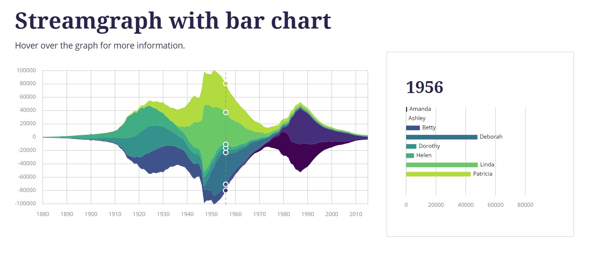
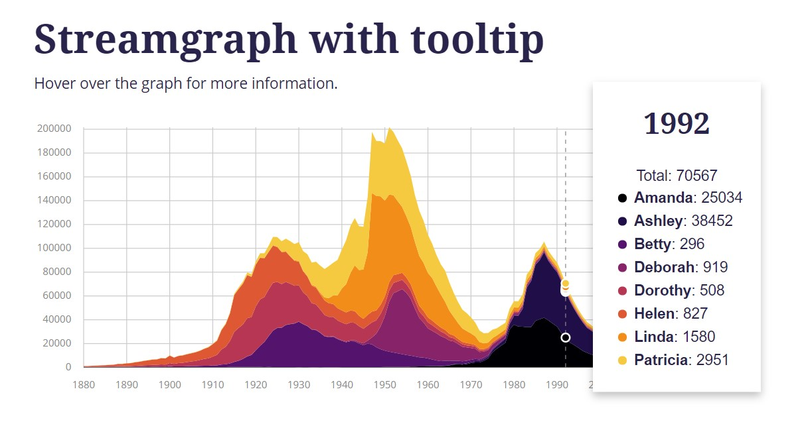

# vue-d3-streamgraph

**vue-d3-streamgraph** implements an interactive streamgraph component and demonstrates a 
Vue oriented way to integerate D3.js. This approach uses D3 mainly for 
calculations whereas Vue stays responsible for actually rendering and updating DOM elements.
The setup is modular, so the basic components (tooltip, paths, axis, ...) could be reused for
other types of graphs.
 

### Demo
Try it out [here](https://www.martinascharrer.at/#/portfolio/streamgraph/demo)

This project was developed as part of my Bachelor's thesis which evaluates the different 
approaches of integrating D3 into Vue (more about that [here](http://www.martinascharrer.at/#/portfolio/streamgraph)).
The basic streamgraph layout as well as the data comes from [d3-graph-gallery](https://www.d3-graph-gallery.com/graph/streamgraph_basic.html).